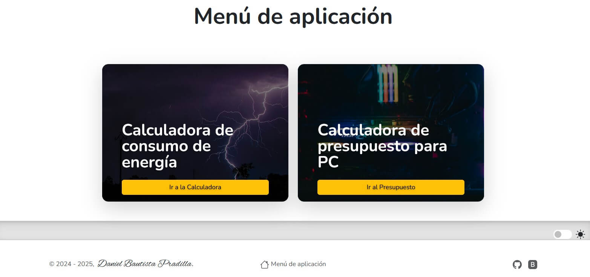
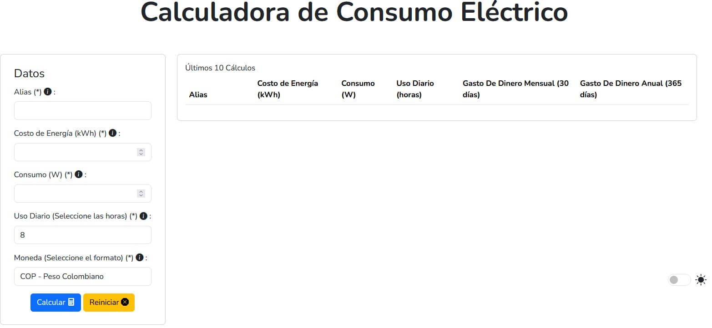
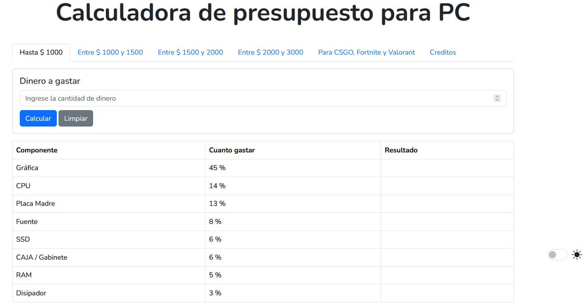

# Consumo Watts

Valor del consumo de artículos eléctricos y electrónicos. Este simple programa te da el valor del dinero a pagar en la factura a fin de mes y dentro de un año, para tener un panorama claro de cuánto consume un equipo en plena carga.

# Presupuesto para armar PC por piezas

Programa inspirado en la idea de @HeLion1ero. Con base en la cantidad de dinero disponible, te da un valor aproximado de gasto por componente para tener un equilibrio en la compra de las piezas.

# Dirección web

https://timbertec.pages.dev/

# Imágenes del proyecto

- **Menú inicial:**
  

- **Calculadora:**
  

- **Presupuesto:**
  
